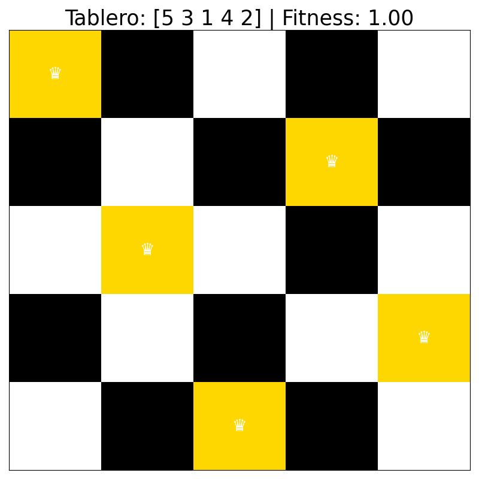

# Algoritmos genéticos



## Ejecución

```
python3 reinas/Simulacion.py 
```

Posteriormente, el programa le pedirá que ingrese el número total de reinas
```
Introduzca el número de reinas:
```

Al finalizar el algoritmo, se mostrará una imagen del tablero óptimo encontrado.
