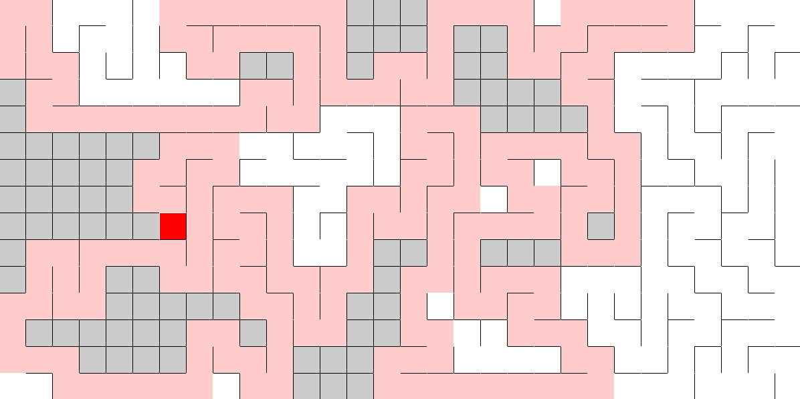

# Backtracking

Generador de laberintos en processing. 




### Ejecución
Para compilar y ejecutar este código desde la terminal se recomiendan los comandos siguientes:

```
mkdir classes
javac -d ./classes -cp lib/core.jar:. laberintos/*.java
java -cp ./classes:lib/core.jar laberintos.Laberinto
```
